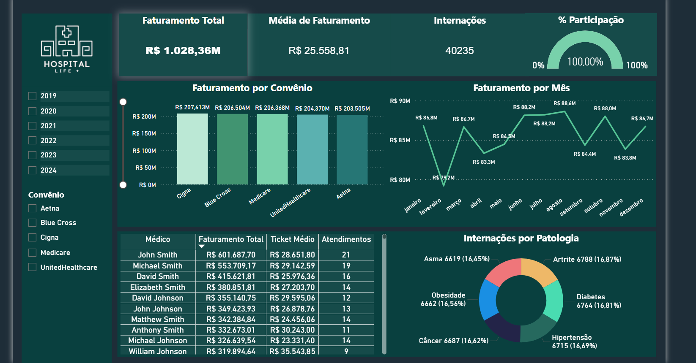

# 🏥 Healthcare Analytics: Análise de Performance Hospitalar



[](https://powerbi.microsoft.com/)
[](https://www.postgresql.org/)
[](https://learn.microsoft.com/dax/)

---

## 📊 Visão Geral

Projeto de **Business Intelligence ponta a ponta** desenvolvido para analisar eficiência financeira e operacional de uma rede hospitalar.

A solução processa **mais de 111.000 registros** de internações, aplicando **ETL em SQL**, modelagem dimensional e visualização estratégica no **Power BI**.

> **Objetivo:** Transformar dados operacionais em decisão executiva baseada em indicadores reais.

---

## 🎯 Problema de Negócio

A gestão hospitalar precisava responder **três questões críticas**:

| Questão | Desafio Estratégico |
| :--- | :--- |
| **Sazonalidade de Receita** | Existe padrão de queda ou pico de faturamento ao longo do ano? |
| **Rentabilidade por Convênio** | Volume de pacientes significa maior lucro? |
| **Perfil de Internações** | Quais patologias impactam mais financeiramente a operação? |

---

## 💡 Principais Insights

- 📉 **Queda recorrente** de faturamento em Fevereiro, com pico entre Junho e Agosto.
- 📊 Convênios com **maior volume ≠ maior rentabilidade**.
- 💰 Internações **oncológicas** apresentam Ticket Médio significativamente superior.
- 📈 Doenças **crônicas** possuem maior frequência e impacto operacional contínuo.

**Impacto Executivo:**

- ✅ Melhor planejamento de fluxo de caixa.
- ✅ Estratégia comercial orientada por margem.
- ✅ Gestão inteligente de leitos.

---

## 🛠️ Stack Tecnológica

### 🔹 Banco de Dados (SQL + PostgreSQL)

- ETL completo (111k registros)
- Criação de índices otimizados
- Modelagem Star Schema
  - Fato: Internações
  - Dimensões: Paciente, Convênio, Patologia, Data

### 🔹 Business Intelligence (Power BI + DAX)

- Medidas: Ticket Médio, Receita Total, % Participação
- Drill-down temporal (ano/mês/dia)
- Filtros dinâmicos multi-nível
- Design executivo (KPIs + storytelling)

---

## 🗄️ Arquitetura de Dados

```mermaid
flowchart LR
    A[CSV Bruto] -->|ETL + SQL| B(PostgreSQL)
    B -->|Star Schema| C{Modelagem}
    C -->|Conexão| D[Power BI]
    D -->|Visualização| E[Dashboard Executivo]

Processamento pesado no banco garante performance e escalabilidade.

📂 Estrutura do Repositório
/sql        → Scripts DDL/DML, ETL e validação
/dashboard  → healthcare_analytics.pbix
/dataset    → hospital_internacoes.csv (111k registros)
/assets     → Screenshots, banner e documentação

🚀 Como Executar
1️⃣ Clone o repositório
git clone https://github.com/paulohenriquelima95/Healthcare-Analytics-PowerBI-SQL.git
cd Healthcare-Analytics-PowerBI-SQL
2️⃣ Configurar PostgreSQL
psql -U postgres -f sql/healthcare_analytics_db.sql
3️⃣ Abrir Power BI

Abra dashboard/portfolio_hospitalar_db.pbix

Atualize a conexão para seu PostgreSQL local

🎯 Competências Demonstradas

✅ Modelagem Dimensional (Star Schema)

✅ SQL Avançado (ETL / Window Functions)

✅ Engenharia de Dados

✅ Power BI + DAX Avançado

✅ Análise Financeira Hospitalar

✅ Storytelling Executivo

✅ Performance Tuning (Banco + BI)
## 👨‍💻 Autor

Paulo Henrique Lima  
Analista de Dados | SQL | Power BI | Python
